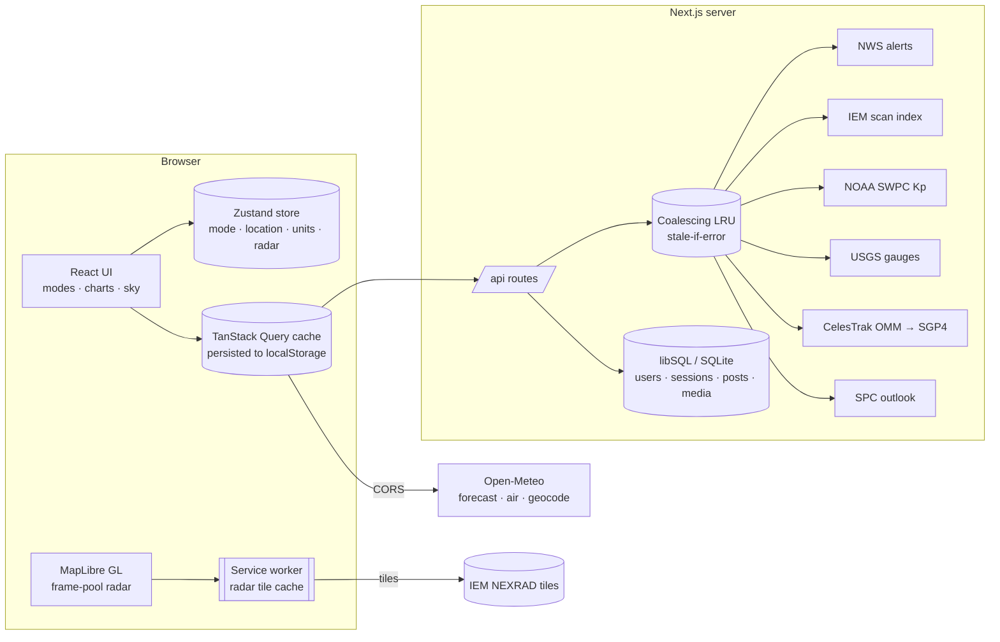

# StormCentral — System Architecture

StormCentral is a Next.js 16 (App Router) application. The browser does the heavy lifting where free APIs allow it (forecasts, radar tiles); a thin server layer proxies, reshapes and caches the feeds that need a User-Agent, shared caching or heavy computation. Community features (accounts, reports, photos) run on an embedded libSQL/SQLite database.



---

## 1. State management

State is split three ways, and each kind lives in exactly one place:

| Kind | Where | Why |
|---|---|---|
| **UI and preference state**: active mode, location, units, radar settings, drone profile | `src/store/app-store.ts` (Zustand + `persist`) | Tiny and synchronous. Any component can subscribe to one slice without context re-render cascades. |
| **Server state**: forecasts, alerts, scans, gauges, posts | TanStack Query (`src/hooks/queries.ts`) | Deduplication, background refetch, retries, `keepPreviousData` for flicker-free location changes. |
| **Shareable view state**: `?mode=&lat=&lon=&name=` | URL, two-way synced by `useUrlSync` | Any view can be linked. Sync uses `history.replaceState`, so it causes no router re-render. |

**Hydration safety.** The store is created with `skipHydration` and rehydrated in a client effect, so server HTML and the first client render match. A `hydrated` flag gates every query, which avoids fetching the default location before the user's saved location is restored.

**Modes are projections, not pages.** `src/modes/registry.ts` defines each mode's identity (label, short mobile label, line icon, hotkey, whether it is map-first) and a **polling policy** per feed:

| Feed | Daily | Severe | UAV | Angler | Air |
|---|---|---|---|---|---|
| Forecast (Open-Meteo) | 10 min | 5 min | 10 min | 10 min | 10 min |
| Local alerts | 5 min | **60 s** | 5 min | 5 min | 5 min |
| National warning polygons | — | **45 s** | — | — | — |
| Radar scan index | 2 min | **60 s** | — | — | — |
| Kp / GNSS | — | — | 15 / 10 min | — | — |
| River gauges | — | — | — | 10 min | — |
| Air quality | 30 min | — | — | — | 15 min |

All modes read the same normalised forecast (a columnar struct-of-arrays, stored in SI units), so switching modes never refetches cached data. Hovering or focusing a mode tab calls `prefetchMode()` to warm that mode's feeds, so the switch lands on data instead of skeletons. Each mode is a separate `next/dynamic` chunk; the map-heavy modes never download for a user who only reads Daily. Mode changes are a short opacity cross-fade. The UI uses one constant accent (see `docs/DESIGN.md`); colour is reserved for data and status, not per-mode theming. On phones, modes switch from a bottom tab bar, and Severe mode's controls live in a draggable bottom sheet.

Units are a presentation concern. Data stays SI and `formatters(units)` converts at render time, so toggling °F/°C is instant and never triggers a network request.

## 2. API polling and caching layers

There are four cache tiers, from the user outward:

1. **TanStack Query** keys round coordinates to about 1 km, so GPS jitter doesn't bust the cache. Refetching pauses in background tabs, and 4xx errors are never retried. Small location-scoped feeds (forecast, air, Kp) are persisted to `localStorage` for 24 h, so a cold start renders the last known conditions instantly.
2. **Service worker** (`public/sw.js`) serves timestamped radar tiles cache-first. They are immutable, so this is safe. The cache is bounded to 4,000 entries and 6 hours.
3. **Server coalescing cache** (`src/lib/feeds/cache.ts`) is a process-local LRU with **request coalescing**: during an outbreak, thousands of concurrent misses for the national warnings feed collapse into one upstream request. It is **stale-if-error**, so a flaky NWS endpoint keeps serving the last good payload.
4. **CDN**: every proxy response sets `s-maxage` plus `stale-while-revalidate`, so a deployment behind Vercel/Cloudflare absorbs most traffic at the edge.

Server routes also **reshape** the data. National alerts are filtered to storm-based polygons, enriched with NWS hazard colours, impact tags (PDS / emergency / destructive / observed), a severity rank and a parsed storm-motion vector. USGS series are downsampled to hourly values with computed 24 h change. CelesTrak elements are propagated server-side, so the browser receives about 3 KB of sky geometry instead of about 80 KB of orbital elements plus an SGP4 library.

Each route's logic is a **feed** (`src/lib/feeds/`): fetch, parse, cache, with no dependency on Next.js. The route handlers are one-line wrappers (`feedRoute(alertsFeed)`), and the Android app runs the same feeds on the phone (§8).

Every parser in `src/lib/feeds/parse.ts` is pure and tolerant of both legacy and current upstream layouts (for example, both SWPC JSON shapes). Each one is unit-tested against fixtures.

## 3. Memory-safe radar tile caching and animation

The radar pipeline has four stages:

```
IEM scan index ──► immutable frames ──► MapLibre frame pool ──► playback clock
 (/api/radar/scans)   (lib/radar/frames)   (lib/radar/layer-manager)   (hooks/use-radar-loop)
```

- **Frames are immutable.** Each frame is a RIDGE tile pyramid addressed by scan time, e.g. `ridge::TLX-N0B-202610071423/{z}/{x}/{y}.png`. Its id never changes, so frames are diffed by id, and the service worker can cache tiles forever (bounded by size and age).
- **Pre-buffered layer pool** (`RadarLayerManager`). Every frame gets its own raster source and layer at `raster-opacity: 0`. MapLibre fetches and uploads tiles for zero-opacity layers but skips drawing them, so the whole loop is prefetched into GPU textures at zero per-frame render cost. Animating is then a paint-property flip, with an optional cross-dissolve via `raster-opacity-transition`. No network requests or texture uploads happen on the hot path, so there is no stutter.
- **The newest frame is requested first.** Layers are added newest-first, so the current scan's tiles head the request queue.
- **Buffer-aware playback.** The manager tracks per-frame readiness from `sourcedata`/`idle` events. The clock (`nextPlayableIndex`) only advances onto buffered frames, so viewers never see a half-loaded frame. The timeline shows buffer state per tick, the last frame dwells 3.2× longer so "now" registers, and the cross-fade is clamped to 45 % of the frame interval so frames never double-expose at 4×.
- **Bounded memory.**
  - Frames are capped by `navigator.deviceMemory`: 8 frames at ≤2 GB, 12 at ≤4 GB, 20 above. A new volume scan adds exactly one source and evicts the oldest, freeing its GPU textures immediately, so memory stays flat no matter how long the loop runs.
  - Source `maxzoom` is 8 for the mosaic and 10 for single sites. Beyond that MapLibre over-zooms existing textures instead of fetching new tiles.
  - The map's `maxTileCacheSize: 48` caps each source's off-screen tile cache.
  - Worst case: 20 frames × (≈24 visible + 48 cached tiles) × 256 KB is bounded by design, and typical usage is far lower.
- **Graceful degradation.** If the IEM index is unreachable, the national mosaic falls back to IEM's rolling `-m05m…-m55m` composite layers, which need no index.
- **Discovery-driven product UI.** Available products and tilts per site come from IEM (`operation=products`), so the UI never offers a tilt or dual-pol product the radar isn't producing.

Overlays (warnings, storm tracks, SPC outlook, radar sites, spotter reports, AQI heat raster) are null-rendering React components that insert into named **z-order slots**: invisible marker layers created on map load. Stacking is therefore deterministic regardless of mount order, and radar renders beneath the basemap's place labels. Selections from map clicks go to React state and render in overlay panels (a bottom sheet on phones); user content is never injected into map popups as HTML.

## 4. Science modules (all pure, all unit-tested)

| Module | What it does |
|---|---|
| `astro/*` | Sun and moon ephemerides, refraction, twilight crossings, moon phase/illumination, solunar major and minor periods |
| `science/wind` | u/v vector math, bulk shear and veer, log-height wind interpolation |
| `science/atmosphere` | Magnus dew point, LCL, BKN/OVC ceiling estimate, density altitude, water-temperature estimate |
| `science/pressure` | Met Office/WMO 3-hour tendency terms |
| `science/dop` + `gnss` | SGP4 propagation, look angles, GDOP/PDOP/HDOP/VDOP |
| `science/storm-motion` | Parses NWS `eventMotionDescription`; projects storm tracks and computes an ETA corridor |
| `science/scores` | UAV flyability (encodes 14 CFR 107 visibility and cloud-clearance minimums) and angler Bite Index, each explaining its factors |
| `science/air` | EPA AQI (2024 PM2.5 breakpoints), NAB pollen scales, cleanest outdoor window |

## 5. Auth and community security model

- **Passwords:** Node's built-in scrypt (N=2^15, r=8, p=3), self-describing encoded parameters, `timingSafeEqual`, and a dummy verification for unknown users so response timing can't enumerate accounts.
- **Sessions:** a 256-bit opaque token in an `HttpOnly`, `SameSite=Lax`, `__Host-` cookie (production). Only its SHA-256 is stored. Sessions are sliding (30 days, extended in the second half of their life), and expired sessions are purged opportunistically.
- **CSRF:** every mutating route requires `Origin` to match `Host`, in addition to SameSite.
- **Rate limits:** sliding-window limits per IP and per account for login (stuffing and spraying), registration, posting, verifying and commenting.
- **Uploads:** client re-encodes photos to ≤1600 px WebP, which drops metadata. The server **does not trust the client**: it sniffs magic bytes, strips JPEG APP1/APP13/COM, PNG text/eXIf chunks and WebP EXIF/XMP chunks (fixing VP8X flags and the RIFF size), and serves media with `nosniff` and a sandboxing CSP.
- **Privacy:** report coordinates are rounded to about 1 km unless the user opts in to precise GPS.
- **CSP:** a strict allow-list of the upstream origins the browser talks to directly, plus `frame-ancestors 'none'` and `object-src 'none'`.
- Cascading deletes are explicit (batch) because libSQL's connection pool doesn't guarantee `PRAGMA foreign_keys` per connection.

## 6. Rendering the sky

`WeatherBackground` computes the **true solar altitude** at the selected location (refreshed every 5 minutes) to pick night, astronomical, nautical and civil twilight, golden hour or day palettes. All palettes fall to true black at the bottom (OLED-friendly, text-safe). On top of that:

- Motion-driven cloud blobs scaled by cloud cover and pushed by the real east–west wind component.
- A Canvas2D precipitation engine: one batched path per frame, DPR capped at 1.5, particle budget scaled to screen area and to both WMO intensity and measured mm/h. Wind sets the rain slant.
- Procedural lightning for convective codes, plus fog banks and twinkling stars.

The loop parks when the tab is hidden, pauses under immersive map modes, and renders a single static frame under `prefers-reduced-motion`.

## 7. Testing

`npm test` runs Vitest across astronomy (validated against real 2024 moon phases and a Chicago solstice sunset), wind and pressure science, scoring, DOP, storm-motion ETA, radar frame/playback/layer-manager logic (with a mock map), upstream parsers, image metadata stripping, password hashing, chart geometry and a schema-drift test that runs every table through Drizzle on a database created from the bootstrap DDL. A registry test checks that every feed route is also available to the Android app's in-app dispatcher, so the two can't drift apart.

## 8. Desktop and Android apps

```
                 ┌─ web ──────► next build ──────────────► Node host / Vercel
src/ (one app) ──┼─ desktop ──► standalone server ─► Electron (desktop/) ─► NSIS installer
                 └─ mobile ───► static export ────► Capacitor (android/) ─► APK
```

`BUILD_TARGET` in `next.config.ts` selects the output; `scripts/build-native.mjs` drives the native builds.

**Windows (Electron).** `desktop/server.mjs` runs the `standalone` Next.js server in an Electron utility process, bound to `127.0.0.1:47613`. The port is fixed so the UI keeps one origin, and with it its localStorage and query cache, across launches. Because the app's own server runs locally, every feature works offline from any hosting, including accounts: the SQLite database lives in the user's app-data folder, outside the install directory that updates replace. Running on loopback HTTP needs two server settings. `SESSION_COOKIE_SECURE=false` drops the `__Host-`/Secure cookie, which plain HTTP can't carry. `ALLOWED_HOST` pins the Host header for writes, so a DNS-rebinding page can't reach the local database. The window is sandboxed with context isolation and no Node integration, navigation is locked to the app's origin (other links open in the default browser), and only geolocation, clipboard-write and fullscreen permissions are granted. electron-updater checks GitHub Releases on launch and every 4 hours, downloads in the background, and asks before restarting.

**Android (Capacitor).** A static export can't include route handlers, cookies or server-rendered pages. Its build uses `pageExtensions: ["tsx"]`, which drops every `route.ts` along with pages named `*.server.tsx` (the profile page). `getJson()` sends `/api/*` requests to `lib/native/local-api.ts` instead, which runs the matching feed in-process with `CapacitorHttp`, the platform's HTTP stack. That way NWS, SPC, USGS and CelesTrak work despite missing CORS headers, and the NWS User-Agent can be set. The cache keeps CelesTrak elements in localStorage for 6 hours, which honours CelesTrak's re-download etiquette across app restarts. GNSS needs SGP4 in the browser, so `lib/science/sgp4.ts` imports satellite.js's pure-JS modules directly, bypassing its WASM entry. The spotter network needs the shared database. `COMMUNITY_ENABLED` is false in this build, which hides its entry points. The web view runs edge-to-edge, and the layout pads its fixed chrome with `env(safe-area-inset-*)`. The app checks the latest GitHub release at most every 6 hours and offers the new APK.

**Hosted mode.** With the `STORMCENTRAL_URL` repository variable set, both apps load that deployment instead (Electron loads the URL; Capacitor's `server.url`). Every user then shares one spotter network, and web changes reach the apps on deploy, without a new release.

**Releases.** `.github/workflows/release.yml` checks the code (typecheck, lint, tests). It then builds the installer on Windows and smoke-tests the bundled server's native database module there, and builds the APK on Linux. For a `v<version>` tag matching `package.json`, it publishes one GitHub release with `StormCentral-Setup-<version>.exe`, its blockmap, `latest.yml` (the electron-updater feed) and `StormCentral-<version>.apk`.
